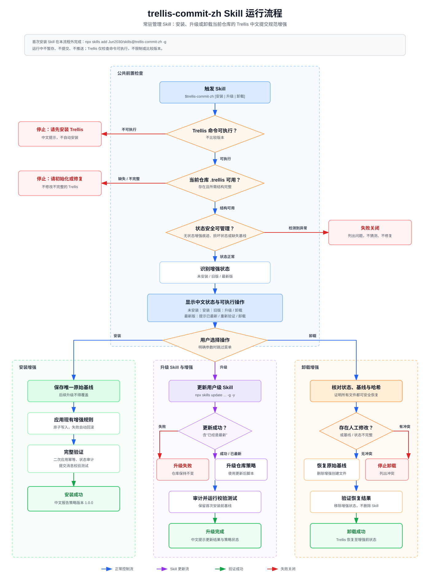

# Jun2030 Skills

## Skill 目录

| Skill | 用途 | 类型 |
|---|---|---|
| [`trellis-commit-zh`](skills/trellis-commit-zh/) | 安装、升级、验证或安全卸载 Trellis 中文提交消息增强 | Platform-Specific Skill |

## `trellis-commit-zh`

为已初始化的 Trellis 仓库管理中文提交消息规范增强的完整生命周期。Codex 会识别仓库状态，只提供当前可执行的安装、升级、重新验证或卸载操作，并在能够证明安全时恢复首次安装前的实际状态。

安装：

```powershell
npx skills add Jun2030/skills@trellis-commit-zh -g
```

调用：

```text
$trellis-commit-zh
```



## 仓库约定

- 发布单元位于 `skills/<skill-name>/`，目录名与 frontmatter `name` 一致。
- 每个 Skill 独立运行，不读取兄弟 Skill 的文件。
- `main` 只保留通过发布检查的 Skills；草稿留在分支或 Pull Request。
- 相关 Skills 通过文档关联；只有需要组合安装时才使用 skills.sh Pack。
- 仓库 Release 使用 SemVer tag；Skill 可以另外维护语义独立的策略版本或产物版本。

## 贡献

欢迎提交 Issue 和 Pull Request。仓库所有者保留最终合并、排序和发布决定权。

## 许可证

[MIT](LICENSE)